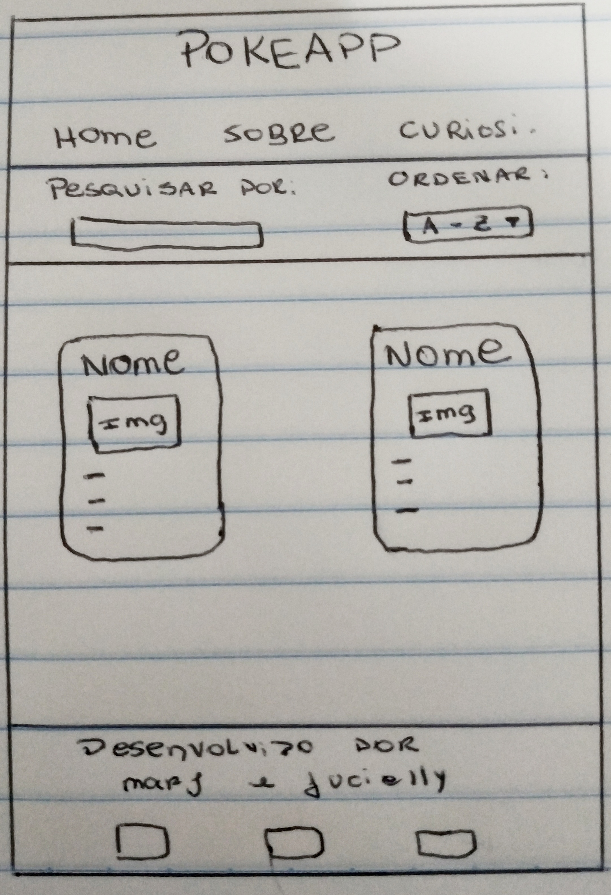
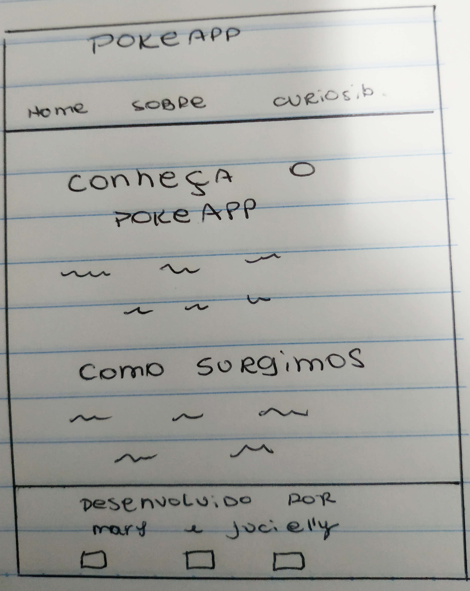
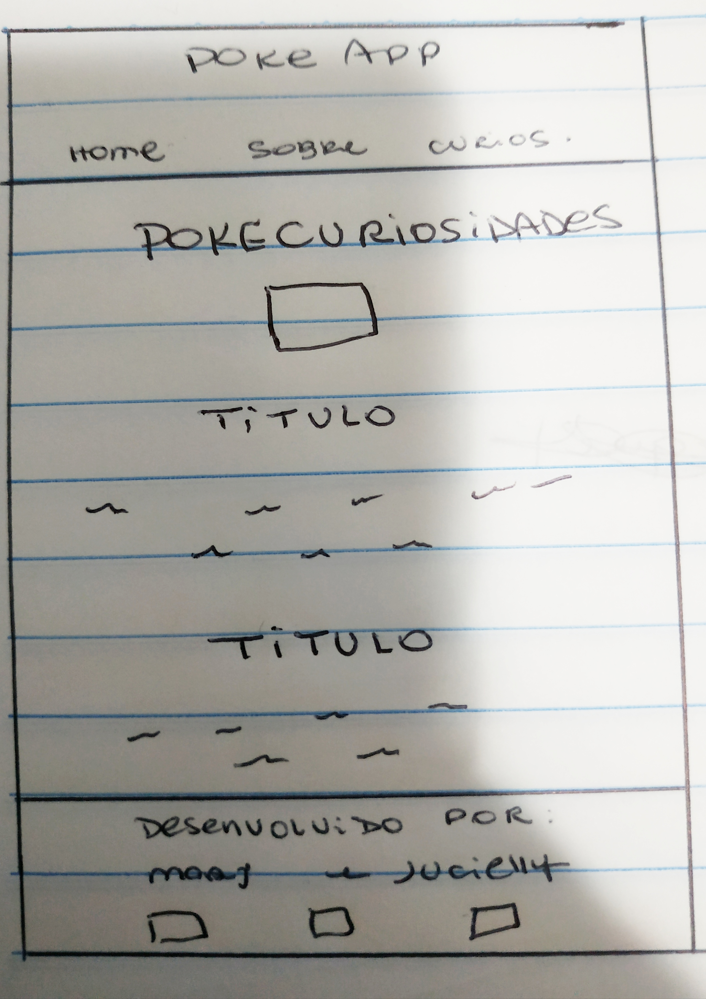
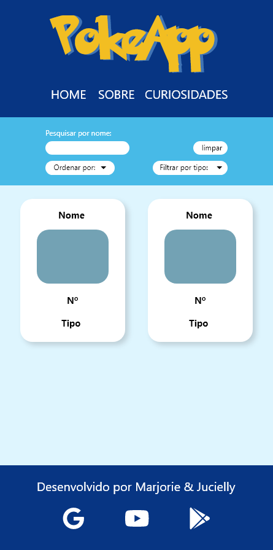
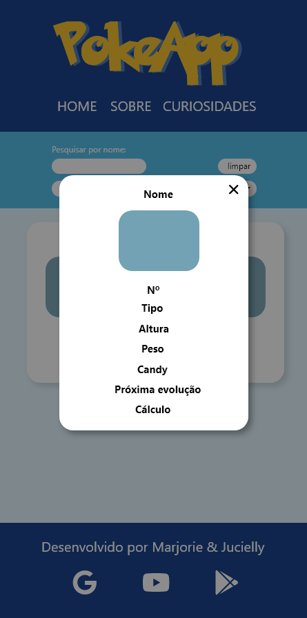
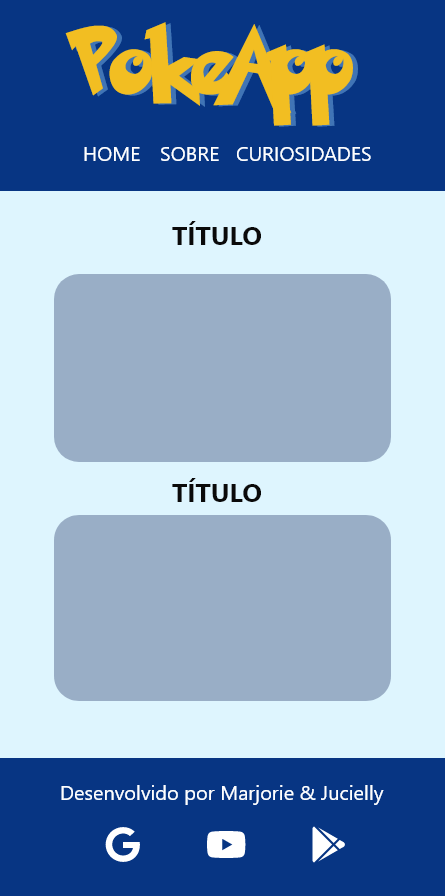

# PokéApp

## Índice

* [1. Introdução](#1-introducao)
* [2. PokéApp](#2-pokeapp)
* [3. Desenvolvimento](#3-desenvolvimento)
* [3.1 Protótipo de baixa fidelidade](#3.1-prototipo-de-baixa-fidelidade)
* [3.2 Pesquisa de usabilidade e definição de usuários](#3.2-pesquisa-de-usabilidade-definicao-de-usuarios)
* [3.3 Teste de usabilidade](#3.3-teste-de-usabilidade)
* [3.4 Refatoração](#3.4-refatoracao)
* [4. Considerações técnicas](#4-consideracoes-tecnicas)

***

## 1. Introdução
O presente projeto foi realizado em duplas, com o objetivo de desenvolver uma página web que permitia vizualizar e manipular dados, fornecendo algumas funcionalidades de acordo com as necessidades e histórias do usuário.
O banco de dados escolhido foi o do Pokémon.

***

## 2. PokéApp
O PokéApp foi criado a partir de uma frustração dos usuários com páginas que possuem muita informação e que não são fáceis de localizar o que se procura. Com isso, tivemos o intuito de fornecer aos visitantes uma experiência agradável, onde tudo pode ser localizado com objetividade e clareza. A plataforma permite você descobrir o mundo Pokémon e explorar cada um deles e suas peculiaridades.
***

## 3. Desenvolvimento
As tecnologias utilizadas nesse projeto foram:
* CSS
* HTML
* ES6
* Jest

**Arquivos**
* `src/index.html` Primeira página exibida ao usuario contendo todos os pokemons e filtros.
* `src/sobre.html` Página para informar ao usuário sobre o projeto.
* `src/curiosidades.html` página contendo as curiosidades do universo Pokémon.
* `src/main.js` contém os códigos relacionados a manipulação do DOM.
* `src/data.js` contém as funções puras utilizadas na manipulação do DOM.
* `src/style.css` estilização da página.
* `test/data.spec.js` contém os teste unitários das funções implementadas no arquivo data.js.

***

## 3.1 Protótipo de baixa fidelidade
Após a filtrar as respostas daqueles que responderam nossa pesquisa, definimos uma paleta de cores referente ao tema e prototipamos com papel e caneta as páginas que faria parte da nossa plataforma.
1. Página Home
2. Página Sobre
3. Página de Curiosidades

***

## 3.2 Definição dos usuários:
Para definir os usuário, elaboramos uma pesquisa no forms do google e após obter os dados dispostos, chegamos em duas personas e a partir delas elaboramos nossas histórias de usuário.

### Personas:

#### **Plínio** tem 22 anos, trabalha com administração e seu hobby é jogar videogames.
**o que ele precisa:** 
* conhecer os poderes dos pokémons, pois precisa dessa informação para poder usar em suas batalhas.
* conhecer os tipos dos pokémons para saber qual seria ideal para usar em suas batalhas.
###

#### Paulo tem 10 anos,estuda no fundamental e seu hobby é assistir animes.
**o que ele precisa:**
*  precisa das características principais de cada pokémon porque irá responder um teste para entrar em uma comunidade no facebook que deseja fazer parte;

* O amigo de paulo está curioso sobre pokemons, Paulo quer indicar uma plataforma para que ele possa encontrar o que deseja.
 
**Com Base nas necessidades dos usuários surgiram as seguintes historias:**
* eu como usuário gostaria de poder pesquisar pelo nome do pokémon para não ter que rolar toda a página para achá-lo;

* eu como usuário gostaria de ver as informações dos pokémons em um card como (nome,numero,imagem,tipo etc);

* eu como usuário gostaria de clicar no pokemon e saber mais sobre;

* eu como usuário gostaria de poder ver curiosidades sobre o pokémon em uma página.

## 3.3 Testes de Usabilidade e Técnicos

**Teste de Usabilidade:** 
 Após desenvolvermos a interface principal, enviamos para algumas pessoas e depois que testada pelos usuários voluntários durante o processo de construção da página, avaliamos as sugestões dadas e elaboramos um novo design no Adobe XD para seguirmos como base. 

1. Página Home
2. Página Home + Modal
3. Página Sobre e Curiosidades

**Testes Técnicos:**

 Foram desenvolvidos testes unitários com jest para identificar falhas em nossas funções e  assim  possibilitando a refatoração das mesmas.
***

## 3.4 Refatoração

***

## 4. Como baixar e utilizar o programa:
:warning: Para usá-lo, você precisa instalar o node.js – visto que, eles são empacotados juntos.  :warning:

**Os comandos necessários para executar o programa em sua máquina são:**

* Fazer um Fork e/ou clonar o respositorio na sua máquina com o comando `git clone` + o link do repositorio

* **npm install** - este irá auxiliar na instalação do projeto, no gerenciamento da versões e no gerenciamento de dependências necessárias para executa-lo.

* **npm start** -  executa os scripts que estiverem localizados no arquivo package.json, no caso o **"start"**, devolvendo assim o arquivo do servidor.

* **npm test** - procura pelo script  **test** dentro do package.json, executar o que estiver dentro dele e mostrar se os testes passaram ou não.

* **npm deploy** - publica uma versão do seu projeto no GitHub Pages.

### caso não queira baixá-lo:

você pode acessar a plataforma através do link: [PokeApp](https://marjoriesantos.github.io/SAP004-data-lovers/ "clique aqui")